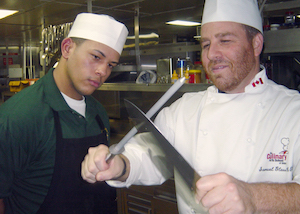

This module is for students who are *already comfortable with git, Vim, and the command line*. It offers a chance to take your skills to a decidedly advanced level. It will take time, and the points available reflect that.
